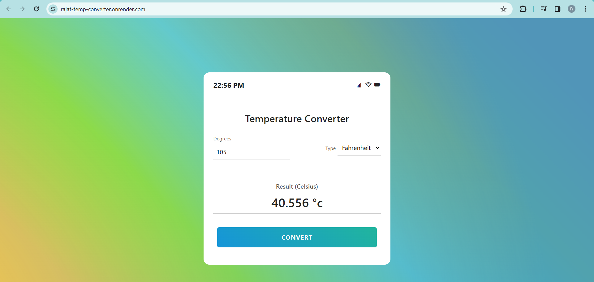
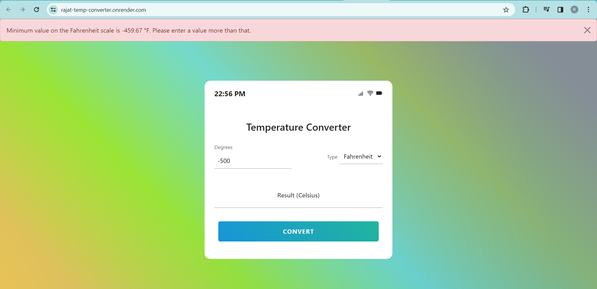

# Temperature Converter Website

Welcome to the Temperature Converter website, a simple tool for converting temperatures between Fahrenheit (°F), Celsius (°C), and Kelvin (K).

## Website Link

Visit the website: [Temperature Converter](https://rajat-temp-converter.onrender.com/)

## Features

- Convert Fahrenheit to Celsius
- Convert Kelvin to Celsius

## Screenshots

### Conversion Success

### Alert Case

## How to Use

1. Open the [Temperature Converter](https://rajat-temp-converter.onrender.com/) website.
2. Enter the temperature value in the input field.
3. Select the source temperature unit (°F or K) from the dropdown.
4. Click the "Convert" button to see the equivalent temperature in Celsius (°C).
5. The result will be displayed below the input form.

## Technologies Used

- HTML
- CSS
- JavaScript

## Repository Structure

- `index.html`: HTML markup for the webpage.
- `style.css`: CSS styles for the webpage.
- `script.js`: JavaScript logic for temperature conversion.

## License

This project is open-source under the [MIT License](LICENSE).
